# Manual de Instalação do Ubuntu 24.04 Desktop

## Índice

- [Requisitos do Sistema](#requisitos-do-sistema)
  - [Requisitos Mínimos](#requisitos-mínimos)
  - [Requisitos Recomendados](#requisitos-recomendados)
- [Videos](#videos)
- [Preparação](#preparação)
  - [1. Transferência da ISO](#1-transferência-da-iso)
  - [2. Criar Mídia de Instalação](#2-criar-mídia-de-instalação)
- [Processo de Instalação](#processo-de-instalação)
  - [1. Arranque](#1-arranque)
  - [2. Ecrã de Boas-vindas](#2-ecrã-de-boas-vindas)
  - [3. Configurações Iniciais](#3-configurações-iniciais)
  - [4. Tipo de Instalação](#4-tipo-de-instalação)
  - [5. Criação de Utilizador](#5-criação-de-utilizador)
  - [6. Localização](#6-localização)
  - [7. Instalação](#7-instalação)
  - [8. Conclusão](#8-conclusão)
- [Configurações Pós-Instalação](#configurações-pós-instalação)
  - [1. Primeiro Arranque](#1-primeiro-arranque)
  - [2. Actualizar o Sistema](#2-actualizar-o-sistema)
  - [3. Instalar Controladores Adicionais](#3-instalar-controladores-adicionais)
  - [4. Instalar Software Essencial](#4-instalar-software-essencial)
  - [5. Configurar Firewall](#5-configurar-firewall)
- [Resolução de Problemas Comuns](#resolução-de-problemas-comuns)
- [Recursos Úteis](#recursos-úteis)
- [Comandos Úteis Pós-Instalação](#comandos-úteis-pós-instalação)
- [Conclusão](#conclusão)

## Requisitos do Sistema

### Requisitos Mínimos
- **Processador**: 2 GHz dual core
- **Memória RAM**: 4 GB
- **Espaço em disco**: 25 GB
- **Resolução de ecrã**: 1024 x 768

### Requisitos Recomendados
- **Processador**: 3 GHz dual core ou superior
- **Memória RAM**: 8 GB ou mais
- **Espaço em disco**: 50 GB ou mais
- **Resolução de ecrã**: 1920 x 1080 ou superior


## Videos

1. [Learn Linux TV - How to Install Ubuntu 24.04 Desktop: Complete Beginner's Guide](https://www.youtube.com/watch?v=zE7OYNkuQ1w)
2. [Nerd on the Street - How to Install Ubuntu 24.04 LTS](https://www.youtube.com/watch?v=WiW4KN2rNZY)
3. [Luba Linux - Como Baixar e Instalar o Ubuntu 24.04](https://www.youtube.com/watch?v=ehn8sgyH8mo)            # PT-BR
4. [Learn Linux TV - How to Deploy Ubuntu 24.04 LTS: Step-by-Step Installation Overview](https://www.youtube.com/watch?v=pln-tglFxwg)  # Install on Proxmox

## Preparação

### 1. Transferência da ISO
1. Aceda ao sítio oficial: [https://ubuntu.com/download/desktop](https://ubuntu.com/download/desktop)
2. Descarregue o Ubuntu 24.04 LTS Desktop (ficheiro .iso)
3. Verifique a integridade da transferência utilizando o checksum SHA256

### 2. Criar Mídia de Instalação

#### No Windows
1. Descarregue o **[Rufus](https://rufus.ie/en/)**, **[balenaEtcher](https://etcher.balena.io/)** ou **[Ventoy](https://www.ventoy.net/en/index.html)**
2. Insira uma pen USB (mínimo 4 GB)
3. Abra o Rufus/Etcher/Ventoy e seleccione a ISO do Ubuntu
4. Seleccione a pen USB como destino
5. Clique em "Iniciar" e aguarde a conclusão

#### No Linux
```bash
# Identifique o dispositivo USB
lsblk

# Crie a pen USB de arranque (substitua /dev/sdX pelo seu dispositivo)
sudo dd if=ubuntu-24.04-desktop-amd64.iso of=/dev/sdX bs=4M status=progress && sync
```

## Processo de Instalação

### 1. Arranque
1. Insira a pen USB no computador
2. Reinicie o computador
3. Entre no menu de arranque (geralmente F12, F2, ESC ou DEL)
4. Seleccione a pen USB como dispositivo de arranque

### 2. Ecrã de Boas-vindas
1. Aguarde o carregamento do Ubuntu
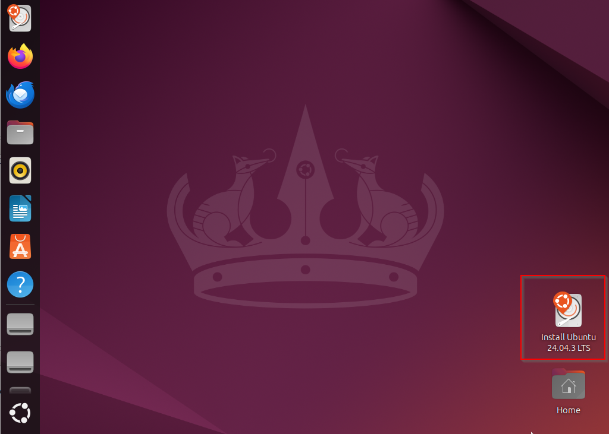
2. Seleccione o idioma (Português)
3. Clique em **"Instalar Ubuntu"** ou **"Experimentar Ubuntu"** (para testar sem instalar)

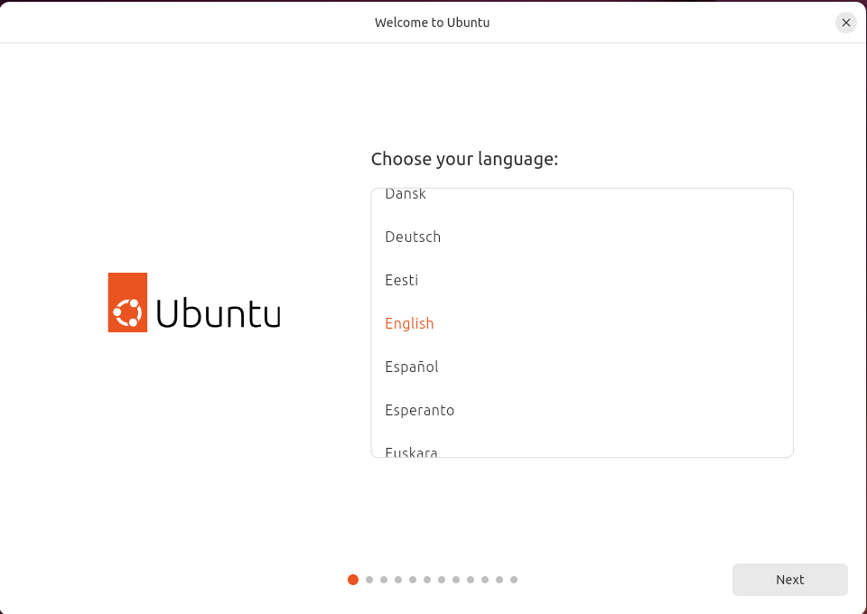

### 3. Configurações Iniciais

#### Teclado
1. Seleccione a disposição do teclado: **Português**
2. Teste a escrita no campo fornecido
3. Clique em **"Continuar"**

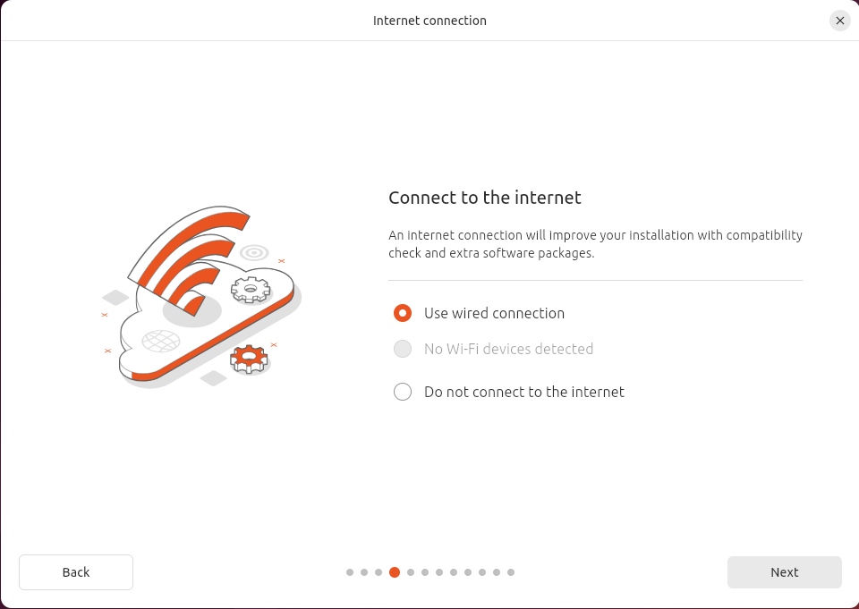

**Atualização do instalador** 
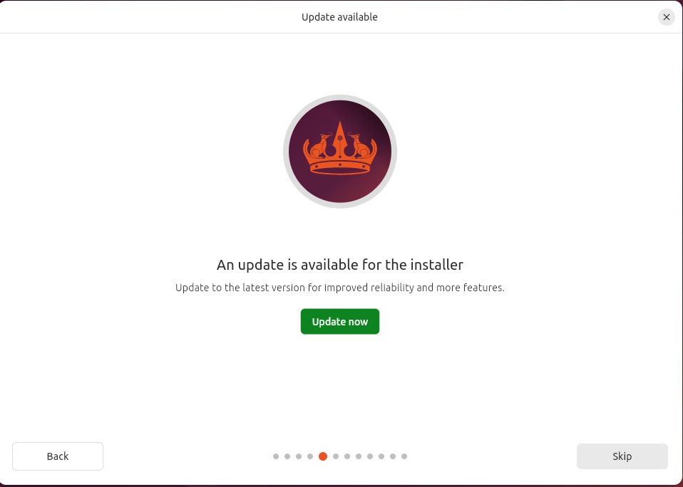


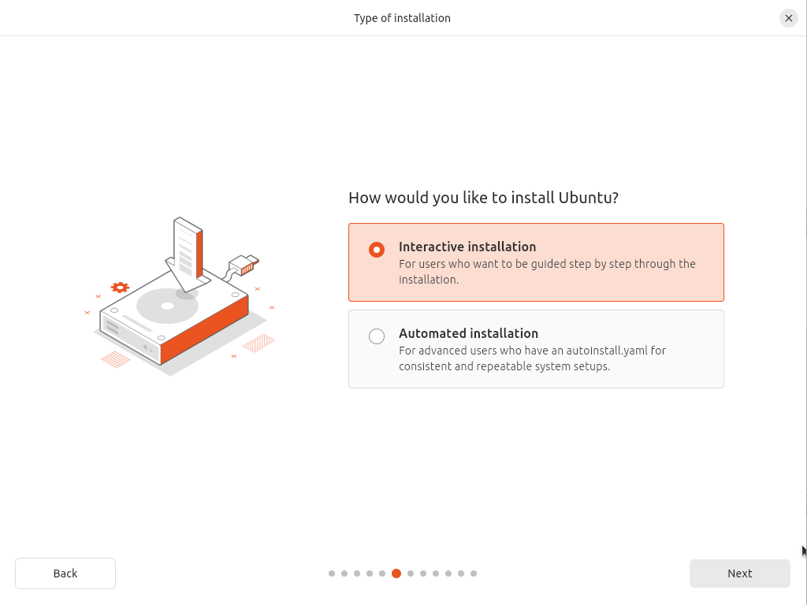

#### Actualizações e Software
1. Escolha entre:
   - **Instalação normal**: Navegador, utilitários, jogos, suite de escritório
   - **Instalação mínima**: Apenas navegador e utilitários básicos
2. Opções adicionais:
   - ✓ Descarregar actualizações durante a instalação
   - ✓ Instalar software de terceiros (controladores de Wi-Fi, gráficos, etc.)
3. Clique em **"Continuar"**

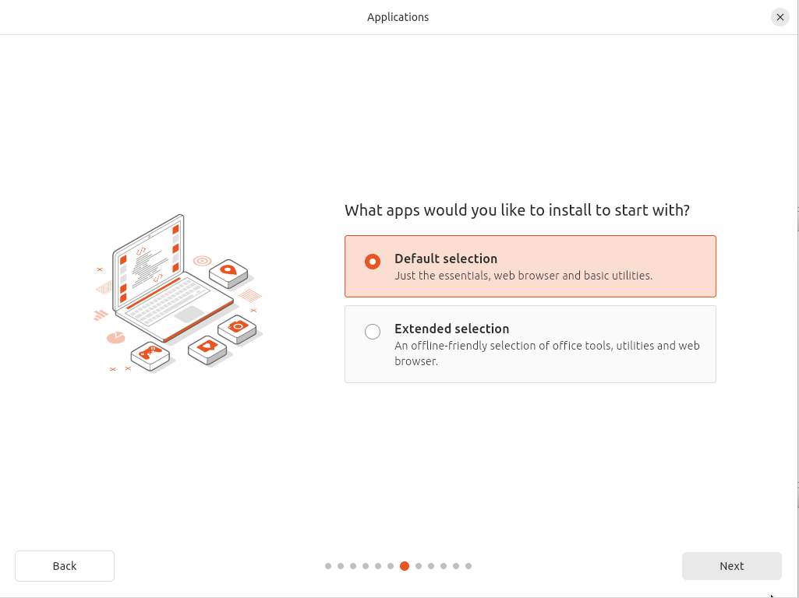

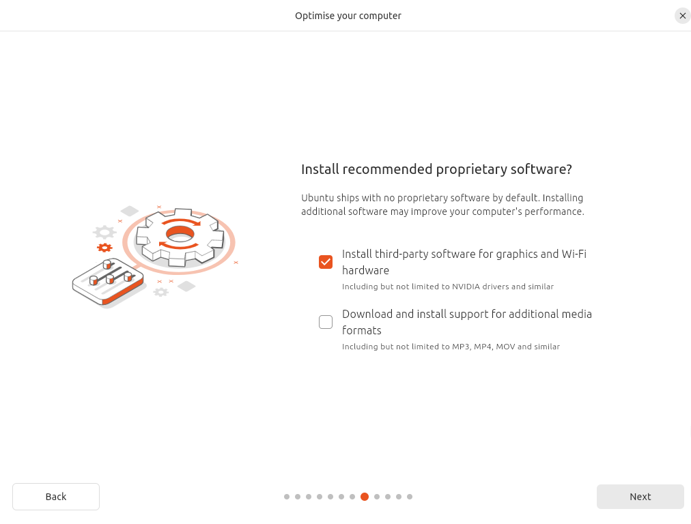

### 4. Tipo de Instalação

#### Opção 1: Apagar disco e instalar Ubuntu (Recomendado para principiantes)
- Remove tudo do disco e instala apenas o Ubuntu
- Mais simples e directo

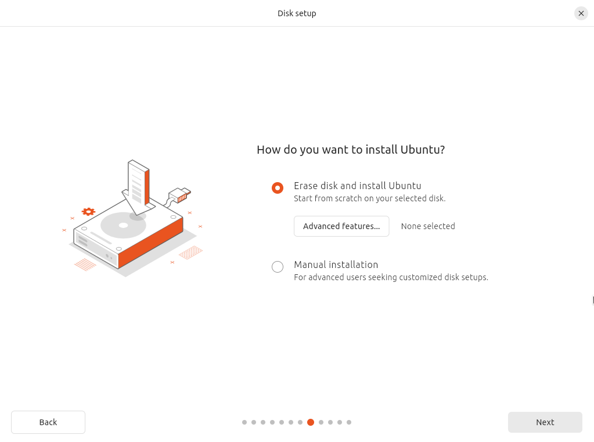

#### Opção 2: Dual Boot (Manter outro sistema operativo)
- Permite ter Ubuntu e Windows no mesmo computador
- O instalador redimensionará as partições automaticamente
- Seleccione quanto espaço deseja alocar para cada sistema

#### Opção 3: Particionamento Manual (Utilizadores avançados)
- Controlo total sobre partições
- Configuração típica:
  - `/boot/efi` - 512 MB (FAT32) - para sistemas UEFI
  - `/` (raiz) - 30-50 GB (ext4)
  - `swap` - Igual à RAM ou 2x RAM (para hibernação)
  - `/home` - Restante do disco (ext4)


### 5. Criação de Utilizador
1. **O seu nome**: Escreva o seu nome completo
2. **Nome do computador**: Nome que identificará o PC na rede
3. **Nome de utilizador**: Início de sessão do sistema (utilize minúsculas, sem espaços)
4. **Palavra-passe**: Crie uma palavra-passe forte
5. **Confirme a palavra-passe**: Escreva novamente
6. Escolha:
   - Início de sessão automático (menos seguro, mais conveniente)
   - Requerer palavra-passe para início de sessão (recomendado)
7. Clique em **"Continuar"**


### 6. Localização
1. Seleccione a sua localização no mapa ou escreva: **Lisboa** (ou a sua cidade)
2. Isto configura o fuso horário
3. Clique em **"Continuar"**

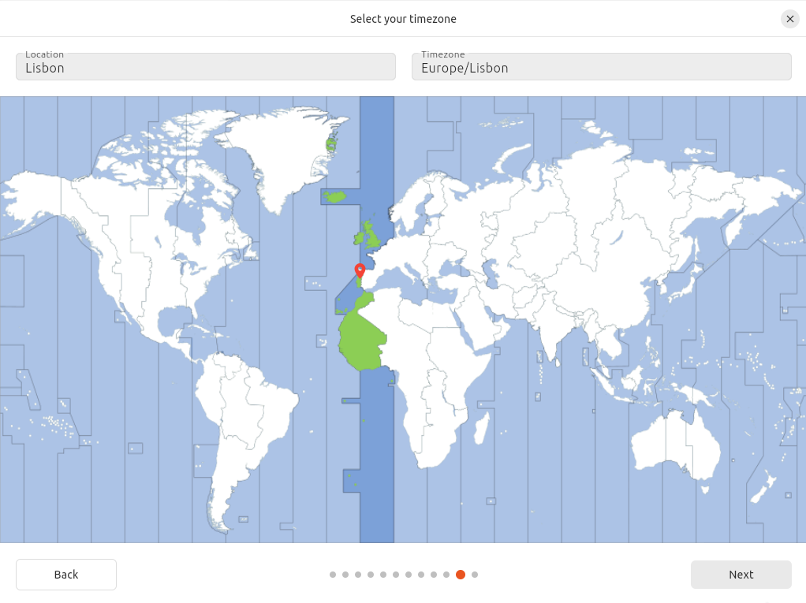


### 7. Instalação
1. Aguarde a instalação dos ficheiros (pode demorar 10-30 minutos)
2. Durante o processo, verá diapositivos sobre o Ubuntu
3. Não remova a pen USB até ver a mensagem final

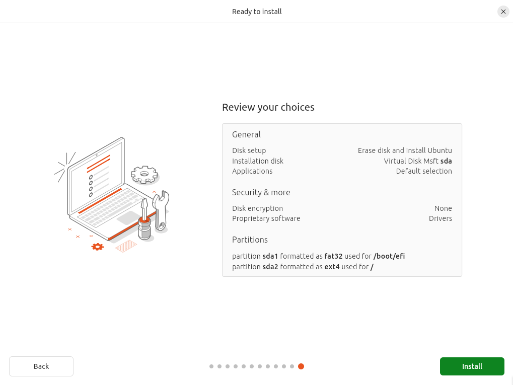

### 8. Conclusão
1. Quando aparecer a mensagem "Instalação concluída"
2. Clique em **"Reiniciar agora"**
3. Remova a pen USB quando solicitado
4. Prima ENTER

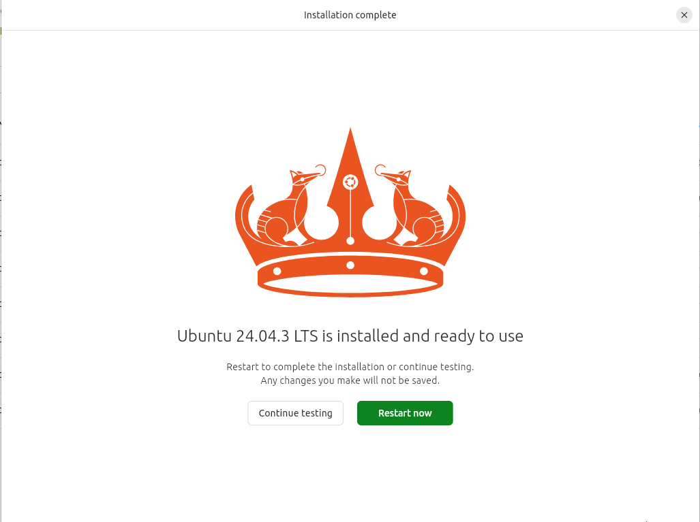

## Configurações Pós-Instalação

### 1. Primeiro Arranque
1. Inicie sessão com o seu utilizador e palavra-passe
2. Siga o assistente de configuração inicial:
   - Ligue as suas contas online (opcional)
   - Configure o Livepatch (actualizações de segurança automáticas)
   - Ajude a melhorar o Ubuntu enviando informações do sistema (opcional)

### 2. Actualizar o Sistema
```bash
# Actualize a lista de pacotes
sudo apt update

# Actualize todos os pacotes instalados
sudo apt upgrade -y

# Remova pacotes desnecessários
sudo apt autoremove -y
```

### 3. Instalar Controladores Adicionais
1. Abra **Software e Actualizações**
2. Vá para o separador **Controladores Adicionais**
3. Seleccione os controladores recomendados (NVIDIA, Wi-Fi, etc.)
4. Clique em **"Aplicar Alterações"**

### 4. Instalar Software Essencial
```bash
# Codecs multimédia
sudo apt install ubuntu-restricted-extras -y

# Ferramentas úteis
sudo apt install git curl wget vim htop -y

# Suporte a compactação
sudo apt install zip unzip rar unrar -y
```

### 5. Configurar Firewall
```bash
# Activar a firewall
sudo ufw enable

# Verificar estado
sudo ufw status
```

## Resolução de Problemas Comuns

### Arranque não encontra o Ubuntu
- Verifique a ordem de arranque na BIOS/UEFI
- Desactive o Secure Boot se necessário
- Certifique-se de que o modo UEFI/Legacy está correcto

### Problemas com Wi-Fi
```bash
# Instale os controladores adicionais
sudo ubuntu-drivers autoinstall
```

### Ecrã preto após instalação
- Prima Ctrl+Alt+F2 para aceder ao terminal
- Instale controladores de vídeo adequados
```bash
sudo ubuntu-drivers autoinstall
sudo reboot
```

### Dual Boot não mostra Windows
```bash
# Actualize o GRUB
sudo update-grub
sudo reboot
```

## Recursos Úteis

- **Documentação Oficial**: [https://help.ubuntu.com](https://help.ubuntu.com)
- **Fórum Ubuntu Portugal**: [https://ubuntuforum-pt.org](https://ubuntuforum-pt.org)
- **Ask Ubuntu**: [https://askubuntu.com](https://askubuntu.com)
- **Ubuntu Wiki**: [https://wiki.ubuntu.com](https://wiki.ubuntu.com)

## Comandos Úteis Pós-Instalação

```bash
# Verificar versão do Ubuntu
lsb_release -a

# Informações do sistema
uname -a

# Utilização de disco
df -h

# Utilização de memória
free -h

# Processos em execução
top

# Informações de hardware
sudo lshw -short

# Informações da CPU
lscpu

# Limpar cache de pacotes
sudo apt clean
```

## Conclusão

Parabéns! Você instalou com sucesso o Ubuntu 24.04 Desktop. Aproveite seu novo sistema operacional Linux!
